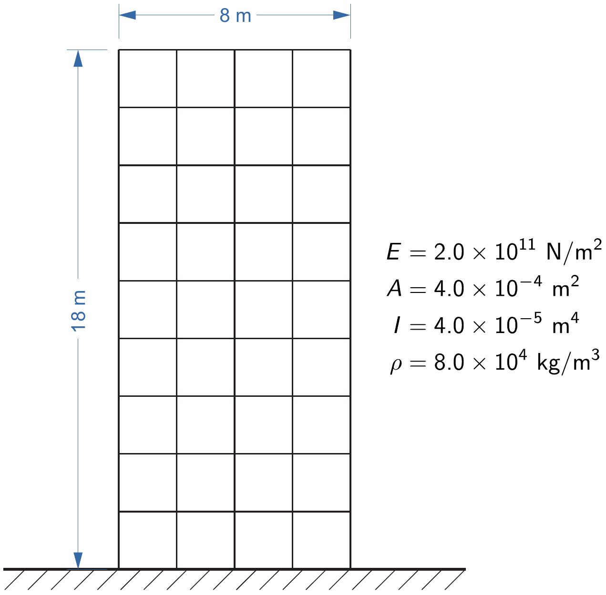

# The enriched subspace iteration method

## Introduction

The enriched subspace iteration method is to find the smallest $p$ eigenvalues
$(\lambda_i; i = 1, \ldots, p)$ and the corresponding eigenvectors
$(\boldsymbol{\phi}_i; i = 1, \ldots, p)$ that satisfy

$$
\mathbf{K} \boldsymbol{\phi}_i = \lambda_i \mathbf{M} \boldsymbol{\phi}_i; 
\quad i = 1, \ldots, p
$$

and

$$
\begin{align*}
\boldsymbol{\phi}_i^T \mathbf{M} \boldsymbol{\phi}_j &= \delta_{ij}, \\
\boldsymbol{\phi}_i^T \mathbf{K} \boldsymbol{\phi}_j &= \lambda_i \delta_{ij}
\end{align*}
$$

where $\mathbf{K} \in \mathbb{R}^{n \times n}$ and $\mathbf{M} \in \mathbb{R}^{n \times n}$ 
are real symmetric sparse matrices (usually obtained
after discretization like finite elements), and $\delta_{ij}$ is the Kronecker
delta.

There are two widely used methods for solving the above eigenvalue problems:
the Lanczos method ([link](https://en.wikipedia.org/wiki/Lanczos_algorithm))
and the subspace iteration method ([Bathe 2014](#Bathe2014)).
While in general the subspace iteration method is slower than the Lanczos
method, the subspace iteration method is particularly more amenable to parallel
implementations. 
The enriched subspace iteration method is a novel extension of the subspace
iteration method, and the improvement is achieved without deteriorating its
favorable feature of being suitable to parallel processing.

**A significant speed-up compared to the subspace iteration method can be achieved**.
Speed-ups observed from some example problems are a factor of 3-5.
Please see [Kim and Bathe 2017](#KimBathe2017) and [Bathe 2014](#Bathe2014) for
the detail of the enriched subspace iteration method.

<!-- The generalized eigenvalue problem defined above arises in many application areas. -->

## Installation

#### Requirements

To build the enriched subspace iteration library you need to have:
- a Fortran 2008 compliant compiler or newer (GCC Fortran or Intel Fortran compilers)
- CMake version 3.13+

#### Installation on Linux

Clone this repository

```bash
git clone https://github.com/ktkimit/esubspace.git
cd esubspace
```

Configure the build and build it with
```bash
cmake -B build -DCMAKE_INSTALL_PREFIX=/to/your/preferred/install/location
cmake --build build
```

Install the library with
```bash
cmake --install build
```

Then the library will be installed into the location you specified with
`DCMAKE_INSTALL_PREFIX` option in the configuration step.

## Usage of the library

The library exports CMake package files to easily find and use it in other
projects.
The CMake files are located in the library directory in the installation
directory you specified with the installation prefix.

You can find and use the installed enriched subspace iteration library by
simply put the following in your CMake configuration
```cmake
find_package(Esspace REQUIRED)
...

target_link_libraries(${PROJECT_NAME} PRIVATE Esspace::Esspace)
```

When configuring your project, don't forget to make the installed enriched
subspace iteration library discoverable by adding its installation directory
to `CMAKE_PREFIX_PATH`.

Please look at the CMake configuration of the example
([CMakeLists](example/frame2d/CMakeLists.txt)) given in this repository. 

#### Example

An example use of the library is given in
[example_frame2d](example/frame2d/).
The example problem is a plane frame structure given below: all the frame
members have the same material properties as described in the figure ($E$:
Young's modulus, $A$: sectional area, $I$: second moment of area, and $\rho$: mass
density).

<p align="center">
  
</p>

We provide a driving source code
[`esspace_main.f90`](example/frame2d/esspace_main.f90) with some input data
files. The binary files `frame2d.stiff` and `frame2d.mass` are the
corresponding stiffness matrix data and mass matrix data, respectively, and the
formatted file `frame2d.in` provides required input arguments. In each binary
file, the matrix data is stored sequentially as follows: the order of the matrix in
single precision, the number of elements below skyline of the matrix in single
precision, array storing the addresses of diagonal elements of the matrix in
single precision, and array storing the elements of the matrix in compacted
form in double precision.

To build the example type the following at its directory
```bash
cmake -B build -DCMAKE_PREFIX_PATH=/to/your/preferred/install/location/lib/cmake
```
Then you will get an executable file named `Example_frame2d`. After running it
the results will be stored in a text file `frame2d.log`.

## References 

- <a id="KimBathe2017">Ki-Tae Kim and Klaus-Jürgen Bathe</a>. The Bathe subspace iteration method enriched by
turning vectors. Computers & Structures, 186:11–21, 2017.
[`pdf`](http://web.mit.edu/kjb/www/Principal_Publications/The_Bathe%20subspace_iteration_method_enriched_by_turning_vectors.pdf)

- <a id="Bathe2014">Klaus-Jürgen Bathe</a>. Finite Element Procedures. Klaus-Jürgen Bathe, Watertown, MA,
second edition, 2014. [`link`](http://www.amazon.com/dp/0979004950)

## License

The software is licensed under [the MIT License](/LICENSE).
